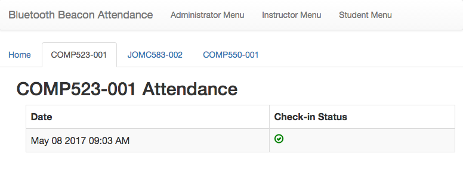

# Bluetooth Beacons for Attendance

[Live Demo](https://shibboleth-yechoorv.cloudapps.unc.edu)  
[Project Website](http://bluetoothbeacon.web.unc.edu/)  
[Android Companion Application](https://github.com/audreysharp/android-bluetooth-beacons)  
[iOS Companion Application](https://github.com/audreysharp/ios-bluetooth-beacons)

This project is meant to provide an accurate attendance tracking mechanism for not only professors but for students as well. Professors can use this application to streamline attendance taking and increase actual learning time spent in the classroom. It can also help them identify specific students who are struggling. For administrators, it can be used to determine the effectiveness of attending classes by comparing student attendance to grades. Finally, students will be provided with a way to track their absences and be more aware of their attendance.

For this to work, we will be implementing a two-factor approach: UNC-CH Shibboleth Single Sign On and proximity of a student’s registered device to Bluetooth Low Energy (BLE) beacons that use Estimote's SDK. By connecting it to Sakai, this will provide an interface for all parties to track attendance rates and seamlessly export the results. Our goal for this project is to make sure that the student signs in at the beginning of class and stays signed in until the end of class when the student signs out. We want to create an application that prevents students from signing other students in. In order to do this, we want to create a small, monitorable zone where students can quickly check in and out by using our application.

### Screenshot



The [live demo](shibboleth-yechoorv.cloudapps.unc.edu) of this application is hosted on Carolina CloudApps.

## Features

#### Students  
* No additional sign-up - log in with your ONYEN
* Use your bluetooth-enabled smartphone to easily check in to your classes
* Sign into the web dashboard to view your class attendance

#### Instructors  
* Use your bluetooth-enabled smartphone to open check-in and check-out windows
* Upload course rosters
* Export attendance data to a .csv file

#### Administrators  
* Associate bluetooth beacons with building rooms
* Run attendance reports for all classes
* Add individual users and define roles for users

## Project Architecture
Backend  
* PHP
* MySQL

Frontend  
* HTML5/CSS3
* Angular.js
* Bootstrap

Bluetooth  
* Estimote Bluetooth Beacons
* Estimote SDK for Android and iOS

## Installation Instructions

This repository contains the code for both the frontend and backend of the application. You can deploy it to [Carolina CloudApps](http://cloudapps.unc.edu/).

1. ```git clone``` this repository and set it up on the Git server of your choosing. The CloudApps-provided Git management site is located at [sc.unc.edu](https://sc.unc.edu).

2. Create a new CloudApps project.

3. Create a new build for the project. You will need a PHP container, a MySQL container, and a Shibboleth Single Sign On container.

4. Set the Git repository to the one you have created: ```git@server:/your-repo.git```. Create Git SSH keys so that your CloudApps project can access the repository. The [CloudApps documentation](http://help.unc.edu/help-tag/cloudapps/) has instructions on how to do this.

5. Run the build.

6. In order to allow teachers and students to check in to their classes, you will need to use either the [Android application](https://github.com/audreysharp/android-bluetooth-beacons) or the [iOS application](https://github.com/audreysharp/ios-bluetooth-beacons). If you'd like, you can test the application by sending POST requests from a REST client.